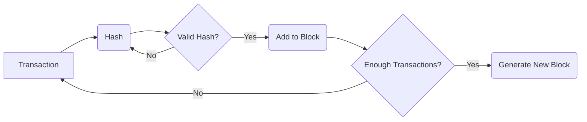
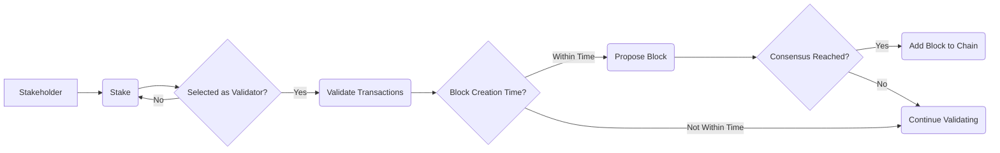
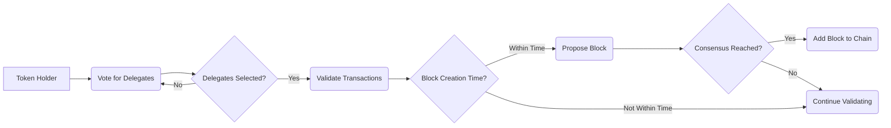
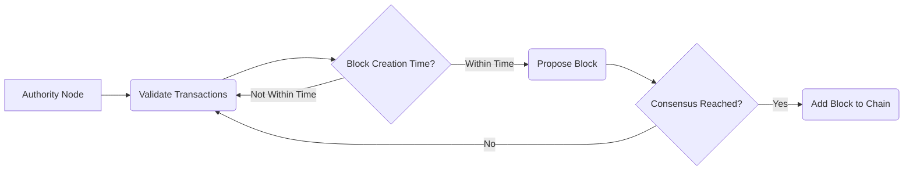
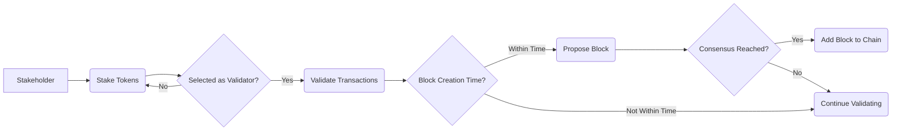
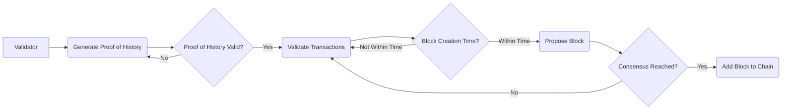
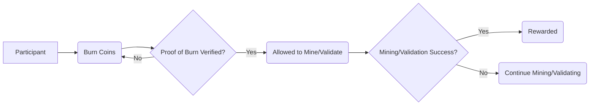
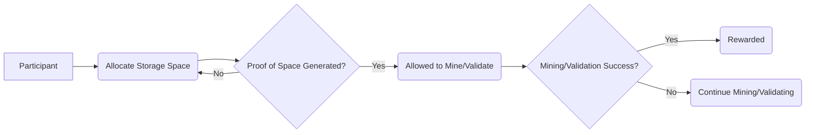
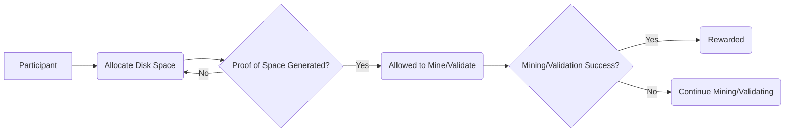
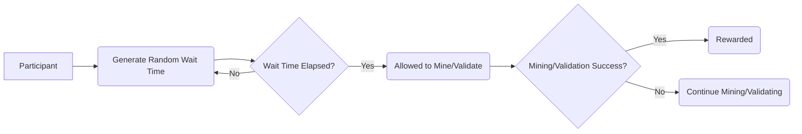

# Consensus

Consensus, in the context of blockchain technology, refers to the process by which all nodes in a decentralized network agree on the validity of transactions and the order in which they are added to the blockchain. Consensus mechanisms are essential for ensuring that the blockchain is secure and immutable.

## Proof of Work (PoW):

Requires participants (miners) to solve complex mathematical puzzles to validate transactions and create new blocks. The first miner to solve the puzzle broadcasts the solution to the network, and if verified, the new block is added to the blockchain.

In this diagram:

- Transactions are hashed.
- The hash is checked to see if it meets the criteria (difficulty) set by the network.
- If the hash is valid, the transaction is added to a block.
- Once a block has enough transactions, a new block is generated and added to the blockchain.

## Proof of Stake (PoS):

Instead of miners, validators are chosen to create new blocks based on the amount of cryptocurrency they hold (their stake). Validators are selected randomly, and their chances of being chosen increase with the size of their stake.

In this diagram:

- Stakeholders stake their cryptocurrency to become eligible for block validation.
- Validators are selected based on their stake to validate transactions.
- Validators propose blocks within a certain time frame.
- If consensus is reached, the proposed block is added to the blockchain.

## Delegated Proof of Stake (DPoS):

Similar to PoS, but instead of all stakeholders being eligible to validate transactions, they vote for a limited number of delegates who are responsible for validating transactions and creating new blocks.

In this diagram:

- Token holders vote for delegates to represent them in the network.
- Delegates are responsible for validating transactions and proposing blocks.
- If consensus is reached, the proposed block is added to the blockchain.

## Proof of Authority (PoA):

A group of pre-approved nodes (authorities) is responsible for validating transactions and creating new blocks. These nodes are typically selected based on their reputation, identity, or stake in the network.

In this diagram:

- Authority nodes are responsible for validating transactions.
- Authority nodes propose blocks within a certain time frame.
- If consensus is reached, the proposed block is added to the blockchain.

## Proof of Staked Authority (PoSA):

Proof of Staked Authority is a consensus mechanism that combines elements of Proof of Stake (PoS) and Proof of Authority (PoA). In PoSA, validators are selected based on the amount of cryptocurrency they hold (staking) and their reputation or authority in the network. These validators are responsible for creating new blocks and validating transactions. PoSA aims to achieve a balance between decentralization and efficiency, as validators are incentivized to act honestly through staking but are also held accountable for their actions.

In this diagram:

- Stakeholders stake their tokens to become eligible for block validation.
- Validators are selected based on their stake to validate transactions.
- Validators propose blocks within a certain time frame.
- If consensus is reached, the proposed block is added to the blockchain.

## Proof of History (PoH):

PoH is a cryptographic clock that provides a way to order transactions efficiently. It helps Solana nodes agree on the time order of events without having to wait for network latency or processing delays. This allows for high throughput and fast confirmation times.

In this diagram:

- Validators generate a proof of history, which is a cryptographic proof of the order of transactions.
- Validators use the proof of history to validate transactions and propose blocks.
- If consensus is reached, the proposed block is added to the blockchain.

## Proof of Burn (PoB):

PoB involves burning, or destroying, cryptocurrency tokens to earn the right to mine or validate blocks. This is used as a way to reduce the total supply of a cryptocurrency.

In this diagram:

- Participants burn (destroy) coins to prove they are committed to the network.
- Those who have burned coins are allowed to mine or validate transactions.
- Successful mining or validation results in rewards for the participant.

## Proof of Capacity (PoC):

PoC requires miners to prove that they have allocated a certain amount of storage space to participate in block creation. This is often used in conjunction with Proof of Space.

In this diagram:

- Participants allocate storage space to prove they are committed to the network.
- Those who have allocated storage space are allowed to mine or validate transactions.
- Successful mining or validation results in rewards for the participant.

## Proof of Space (PoSpace):

Requires participants to allocate disk space to the network to show their commitment to the blockchain. The more disk space allocated, the higher the chance of being chosen to create a new block.

In this diagram:

- Participants allocate disk space to prove they are committed to the network.
- Those who have allocated disk space are allowed to mine or validate transactions.
- Successful mining or validation results in rewards for the participant.

## Proof of Elapsed Time (PoET):

Designed for permissioned blockchains, PoET randomly selects a node to create a new block based on a predetermined waiting time. Nodes must wait their turn, ensuring fairness in block creation.

In this diagram:

- Participants generate a random wait time and wait until it elapses.
- Those who have completed the wait time are allowed to mine or validate transactions.
- Successful mining or validation results in rewards for the participant.
